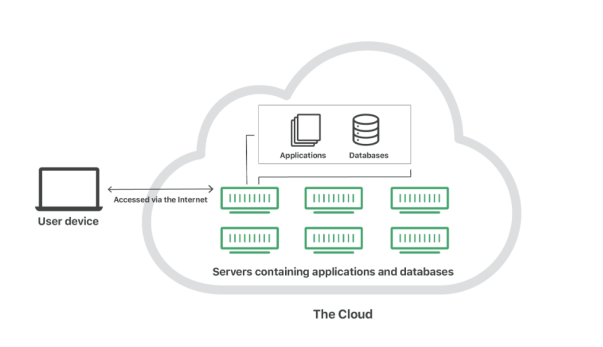
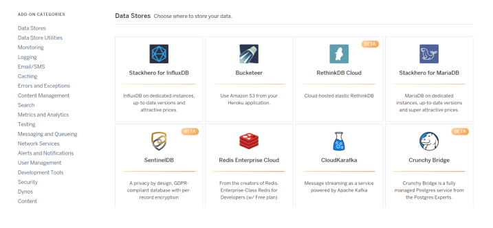
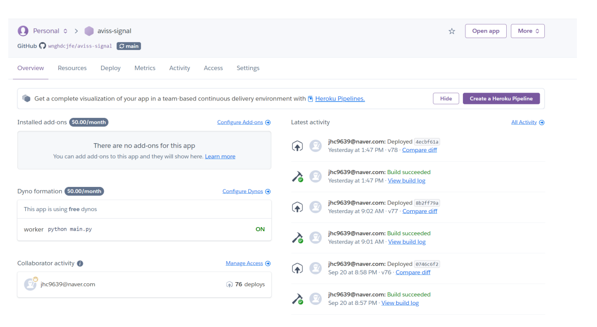
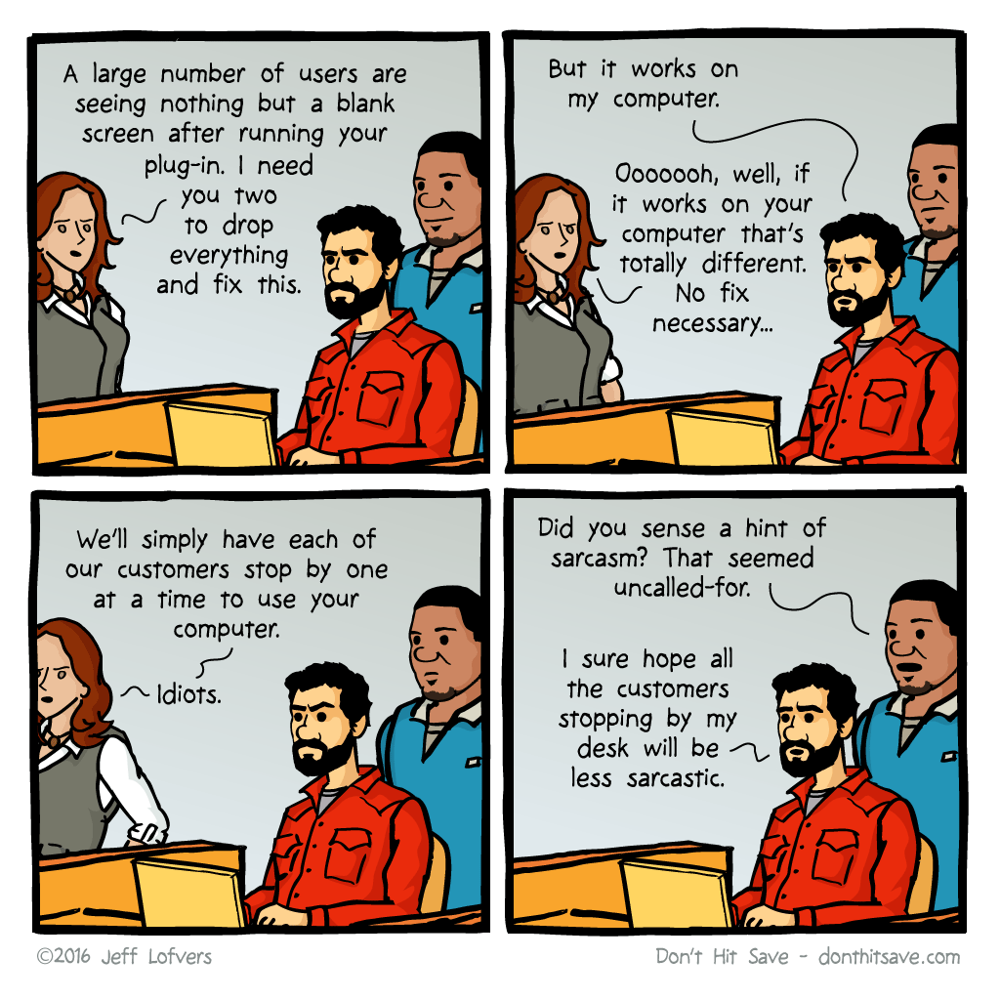
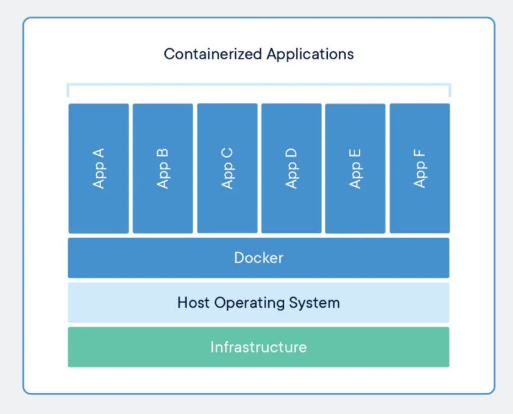
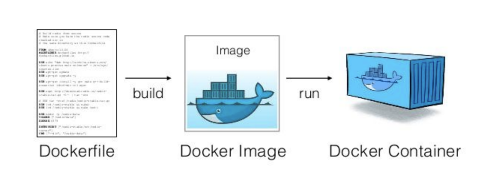
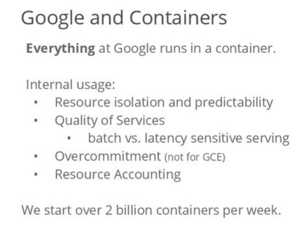

# 클라우드

## 클라우드란?
클라우드 서비스는 내가 아닌 다른 회사의 공급자가 호스팅하고 인터넷을 통해 사용자에게
제공되는 인프라, 플랫폼 또는 소프트웨어를 말합니다.

이를 이용하면 자체 인프라나 하드웨어 설치 없이도 애플리케이션과 리소스에 쉽고 싸게
이용이 가능합니다

분산된 서버를 기반으로 클라우드를 이용하는 모습

이렇게 되면 서버를 직접 구매할 때 고려해야 할 전력, 위치, 서버 세팅, 확장성을 고민하지
않고 서비스 운영에만 집중할 수 있습니다. 이를 오프프레미스(off-premise) 방식이라고
합니다

## 온프레미스 VS 오프프레미스

### 온프레미스(On-premises)

이것은 전통적인 방식으로 컴퓨터 또는 서버실을 갖추고 운영하는 형태를 말합니다.

기업이나 개인이 자체 시설에서 보유하고 직접 유지 관리하는 프라이빗 데이터 센터(IDC)같은걸 의미합니다.

자체적으로 운영하는 것이 자율성은 높지만, 서버의 유지보수면에서는 어려움을 겪을 수 있습니다. 

ex) 네이버데이터센터 각

> 업계 관계자들이 꼽는 춘천의 최대 장점은 '프리쿨링'을 통한 전기 절약이 가능하다는 점이다. 
> 프리쿨링은 서버실 온도를 조절하기 위한 냉각수를 전기가 아닌 외부 찬 공기를 이용해 만드는 방식이다. 
> 산간 지방에 위치한 춘천은 연중 최대 6개월까지 프리쿨링이 가능하다.

=> 데이터센터 냉각시설의 효율화를 위해 강원도로 자리잡음.

### 오프프레미스(Off-premises )

앞서 설명한 클라우드 서비스를 이용해 서드파티 공급업체가 인프라, 시설 및 관련 서비스를 제공하고 유지 관리하는것 입니다.

ex) 아마존의 AWS, 구글이 GCP, 카카오, 네이버 같은 국내 클라우드 등등

---

## 클라우드 서비스 종류
클라우드 서비스들은 제공 범위에 따라 각각 Iaas, Paas, Saas로 나눌 수 있습니다

### IaaS(Infrastructure-as-a-Service)
IaaS는 인프라형 클라우드서비스로서, **기본적인 컴퓨팅 인프라**(예: 서버, 스토리지, 네트워킹)를 제공하고,
사용자는 이 위에 **원하는 운영 체제, 미들웨어, 애플리케이션을 설치하고 구성**할 수 있습니다.

즉, node.js, MongoDB 등을 개발자가 직접 설치하고 환경설정을 해야
하는 대신 특정 서비스에 종속되지 않습니다.

ex) AWS의 EC2, Google의 Compute Engine(GCE), 네이버의 NCP Server기능 

### Paas(Platform-as-a-Service)
PaaS(Platform-as-a-Service)는 플램폼형 클라우드 서비스입니다.

클라우드가 플랫폼을 제공합니다.

Node.js, MongoDB 등의 소프트웨어를 플랫폼단에서 제공하며,  
그저 클릭을 통해 해당 서비스를 이용할 수 있습니다.

일반적으로 모니터링, CI/CD기능도 제공됩니다.

ex) **heroku**

클릭 몇번으로 플랫폼에서 제공하는 서비스들을 설치가 가능함.

 
 

 CI/CD 기능도 제공

### SaaS(Software as a Service)
SaaS는 서비스형 클라우드서비스입니다.

완전한 서비스를 클라우드서비스로부터 제공받아 사용합니다

이 유형에서 사용자는 **소프트웨어를 자신의 컴퓨터에 설치하거나 유지 관리할 필요 없이** 인터넷을 통해 애플리케이션에 액세스할 수 있습니다. 

ex) Google Docs, Microsoft Office 365, DropBox, Slack, Notion 등등 우리가 쓰는 대부분의 공용 소프트웨어 툴들

---
## IaaS vs PaaS

### IaaS

- 유연성과 이식성

IaaS는 **기본적인 컴퓨팅 인프라만을 제공**하기에 사용자는 이 위에 운영체제를 선택하고 
원하는 미들웨어, 애플리케이션을 사용자의 입맛대로 구성 할 수 있습니다. => 말그대로 순수 인프라만 제공!

그렇기 떄문에  IaaS를 사용할시 **특정 플랫폼에 종속되지 않고**, 
 **요구사항에 맞게 인프라를 조정**할 수 있다는 장점이 있습니다.

IaaS의 핵심 장점 중 하나는 바로 이러한 **유연성**입니다.

**이식성**에 관해서도 말해보자면,

IaaS 환경에서 구성한 설정과 애플리케이션은 다른 IaaS 제공자로 비교적 쉽게 옮길 수 있습니다.

(간단하다는 말은 아닙니다... 설치했던 소프트웨어들이나 서버, db 도 다시 설치해야되고,  
운영 체제가 다를 경우 호환성, 네트워크 설정, 보안 설정도 다시 설정해야죠.  
하지만  호환 가능한 운영 체제와 인프라를 사용한다면
소프트웨어를 그대로 이식해서 넣는거는 비교적 큰 이슈가 없다고 생각합니다. .)

정리하자면, IaaS는 PaaS와 비교했을 때 **더 높은 이식성**을 가진다고 할 수 있습니다.

- 운영비 효율

IaaS는 앞서 설명햇듯이 기본 인프라만 제공하므로, 사용자가 운영 환경(예: 로깅, 모니터링, CI/CD)을 
직접 구성하고 관리해야 합니다.
  
즉, PaaS에 비해 초기 설정에 시간과 비용이 더 많이 들 수 있음을 의미합니다.

### PaaS

- 유연성과 이식성

PaaS는 애플리케이션 **개발과 배포를 위한 플랫폼을 제공**합니다.
이는 데이터베이스 관리, 개발 도구, 운영 환경 등을 포함할 수 있습니다. 

PaaS는 **특정 플랫폼과 서비스에 종속**될 수 있으며, 이는 다른 환경으로의 **이식성을 제한**할 수 있습니다.

예를 들어, PaaS에서 제공하는 특정 데이터베이스 시스템을 사용하면, 
이를 다른 환경으로 옮기는 것이 복잡해질 수 있습니다. 

- 운영비 효율

PaaS는 로깅, 모니터링, CI/CD와 같은 운영 도구를 플랫폼에 내장하여 제공해줍니다.

기본적으로 무료로 제공해주고 (일정 트래픽이상만 안 넘으면...),
무료기준을 초과해도 정해진 기준별로 금액책정을해서 제공해주기떄문에

사용자가 이러한 서비스를 별도로 구축하고 관리할 필요가 없습니다.

이로 인해 **시간대비 운영비 효율**이 IaaS에 비해 상대적으로 좋다고 할 수 있습니다.

---

# 도커

개발 과정에서 특히 신입 개발자들이 직면하는 주요 문제 중 하나는 
**환경 설정의 복잡성과 그로 인한 일관성 부족**입니다. 

개발자가 한 환경에서 작업한 애플리케이션을 다른 환경으로 이식할 때, 운영 체제의 차이, 
라이브러리 버전, 시스템 설정 등의 요소들 때문에 예상치 못한 문제가 발생할 수 있습니다.

(아씨.... 난 그냥 개발에만 집중하고 싶은데...? )

흔히 말하는 내 컴터에서는 잘되는데 남의 컴터에서는 안되는 문제를 "It works on my machine" 라고 불립니다.

아놔... 내컴터에서는 잘 된다고!

도커(Docker)는 이러한 문제를 해결하는 데 효과적인 도구가 될수 있습니다

## 도커란?

도커의 구조

도커는 **컨테이너화를 통해 애플리케이션을 포장**하고,  
이를 **어떤 환경에서든 동일하게 실행**할 수 있도록 합니다. 

컨테이너는 **애플리케이션과** 그 애플리케이션의 
**실행에 필요한 모든 종속성**(예: 라이브러리, 시스템 도구, 코드 등)을 포함합니다.

### 컨테이너
컨테이너는 애플리케이션이 한 컴퓨팅 환경에서 다른 컴퓨팅 환경으로 빠르고 안정적으로
실행되도록 코드와 **모든 종속성을 패키징**하는 소프트웨어의 표준 단위입니다.

컨테이너는 OS를 공유하기 때문에 빠르고, **경량화되어있으며 격리성도 훌륭**합니다.

그러나 OS에 문제가 생기면 다른 앱에도 영향을 미칠 수 있습니다.

### 도커
도커는 컨테이너 필요한 기능을 거의 모두 제공하는 플랫폼입니다.

애플리케이션 구동에 필요한 환경설정관련 절차를 도커파일에 작성하고 그 후 빌드를 하면
도커이미지가 생성이 되고 도커이미지를 실행시키면 도커컨테이너가 만들어집니다.

그 후 도커컨테이너에 설정된 프로그램, 데이터 등이 실제 컴퓨팅자원 위에서 돌아가게
됩니다.

컨테이너 생성 과정

즉, 도커는 다음과 같은 과정을 거쳐 컨테이너를 만듭니다.
1. 도커파일 : 패키지, 환경변수설정 등을 기록한 파일입니다. 이를 빌드해 도커이미지로
   변환합니다.

2. 도커이미지 : 컨테이너 실행에 필요한 파일과 설정값, 데이터 등을 포함된 상태값이며
   불변합니다. 하나의 이미지에서 여러개의 컨테이너를 생성할 수 있으며 컨테이너의 상태와는
   무관하게 이미지는 그대로 존재합니다.
   예를 통해 1대의 서버에 환경설정해야 한다면 미리 만들어 놓은 이미지를 다운받아서 이를
   통해 컨테이너만 만들면 끝입니다.

3. 도커컨테이너 : 컨테이너가 실행시키면 도커이미지에 설정된 프로그램, 데이터 등이 실제
   컴퓨팅자원과 연결됩니다

### 도커의 활용사례
이렇게 만들어지는 도커컨테이너를 기반으로 클라우드에 컨테이너배포방식으로 서비스가
많이 운영되고 있습니다.

2014년 구글에서 발표한 자료에 따르면 구글에서 만드는 서비스들 대부분이 도커
컨테이너에 기반하여 쓰이고 있으며 매주 약 20억개의 서비스가 운영된다고 합니다.

2014년 구글 컨테이너 사용 현황

---

도커의 보다 깊이있는 개념과 작동원리, 실제 사용예시 등은 
[데이터 인프라스트럭쳐 레포](https://github.com/jhy0285/data-infrastructure)에 있는 
**도커폴더**에 자세하게 정리해뒀으니 참고하시길 바랍니다. 

